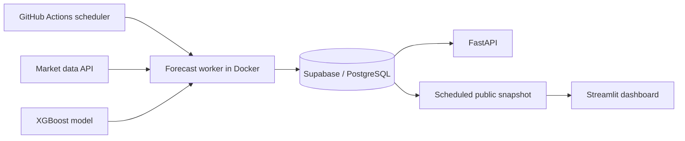

# Türkiye Electricity Demand Forecasting

An end-to-end machine learning project for forecasting Türkiye's hourly electricity consumption and comparing predictions with EPIAS, the national energy market operator.

[**Live dashboard**](https://turkeyelectricityprediction.streamlit.app/)

## The problem

Power systems must schedule generation before electricity is consumed. Errors in the next day's demand forecast make balancing supply and demand harder and more expensive.

The problem is particularly relevant in Türkiye: electricity demand grew by almost 5% per year from 2005 to 2024, the fastest rate among IEA member countries, and continued growth is expected alongside expanding wind and solar generation. Accurate short-term forecasts support more efficient scheduling, market decisions, and grid operation. [IEA: Türkiye 2026](https://www.iea.org/reports/turkiye-2026/executive-summary)

## System design

The scheduled worker retrieves market data, generates the next day's 24 hourly predictions, and stores forecasts with their model version and issuance time. Separate recovery runs collect actual consumption and official forecasts, while a rolling 365-day check repairs gaps in the historical series. FastAPI serves the database for programmatic access. A scheduled export publishes the same historical series for the Streamlit dashboard, so visitors do not query the database.

**Stack:** Python · Pandas · XGBoost · FastAPI · SQLAlchemy · PostgreSQL/Supabase · Streamlit · Plotly · Docker · GitHub Actions

## Results

The XGBoost model achieved **2.84% MAPE** on all **8,760 hours of the held-out 2025 test year**, compared with **3.07%** for the official market forecast.

| Forecast | MAE (MWh) | RMSE (MWh) | MAPE |
|---|---:|---:|---:|
| XGBoost | 1,137.12 | 1,607.69 | 2.84% |
| Official market forecast | 1,236.55 | 1,863.16 | 3.07% |
| Same hour, previous week | 2,018.93 | 3,166.77 | 5.25% |
| Same hour, 48 hours earlier | 3,180.36 | 4,449.93 | 8.17% |

Training uses 2022–2023 data, 2024 is reserved for model selection, and 2025 is held out for final evaluation. The release gate requires the selected model to outperform both naive baselines. [Full evaluation results](reports/evaluation.json)

## Data and modeling

- **Data:** hourly national consumption and official forecasts from Türkiye's energy market operator.
- **Features:** calendar variables, public holidays, 48/72/168-hour demand lags, and daily and weekly rolling statistics.
- **Model:** XGBoost regression with chronological validation and early stopping.
- **Monitoring:** MAE, RMSE, and MAPE are recomputed as actual consumption arrives.

## Dashboard

The dashboard presents the complete historical comparison in one view, including hourly demand curves, model and official forecast errors, monthly performance, coverage, recent system status, and CSV export.
