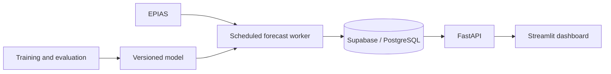

# Türkiye Electricity Demand Forecasting

An end-to-end machine learning project for forecasting Türkiye's hourly electricity consumption and comparing predictions with EPIAS, the national energy market operator.

[**Live dashboard**](https://turkeyelectricityprediction.streamlit.app/)

## The problem

Electricity demand changes with daily routines, weekends, holidays, and seasonal patterns. A useful forecast needs to capture those patterns while using only information available before the target day.

This project combines time-series feature engineering, XGBoost, scheduled data ingestion, persistent monitoring, and an interactive dashboard. It connects model evaluation with the practical work of collecting data, publishing forecasts, and measuring error over time.

## Results

On the held-out 2025 dataset, the consumption-and-calendar model achieved **2.84% MAPE** and reduced MAE by **43.7% against the same-hour-last-week baseline**, across **8,760 hourly observations**.

| Model | MAE (MWh) | RMSE (MWh) | MAPE |
|---|---:|---:|---:|
| XGBoost | 1,137.12 | 1,607.69 | 2.84% |
| Same hour, previous week | 2,018.93 | 3,166.77 | 5.25% |
| Same hour, 48 hours earlier | 3,180.36 | 4,449.93 | 8.17% |

The evaluation uses 2022–2023 for initial training, 2024 for model selection, and 2025 for the final test. The evaluation model is fit through 2024; the production model is subsequently refit through 2025.

These results come from the held-out 2025 evaluation with a 48-hour consumption availability assumption. [Full evaluation results](reports/evaluation.json)

## Data and modeling

- **Source:** hourly consumption from EPIAS, with its official load estimates used as a comparison series.
- **Features:** hour, weekday, season, year, public holidays, consumption lags at 48/72/168 hours, and daily/weekly rolling statistics.
- **Model:** XGBoost regression with early stopping, chronological validation, and fixed random seeds.
- **Data integrity:** an explicit hourly index prevents missing records from shifting lag meaning. Incomplete inputs are rejected before publication.

Training and inference use the same feature implementation. Historical weather is excluded from the current model because its availability at the forecast cutoff could not be verified.

## System design

The worker runs in Docker through GitHub Actions. It publishes the next day's 24-hour forecast before the project's noon Istanbul cutoff, then reconciles observed consumption independently.

Each issued forecast preserves its prediction values, input snapshot, issuance time, and model fingerprint. Retries retain the original forecast. A rolling 365-day integrity check keeps model predictions, actual consumption, and official forecasts complete.

FastAPI serves stored results to Streamlit. The dashboard provides a full-history comparison, daily demand curves, monthly error summaries, and hourly data export. It reads the original monitoring records alongside the newer forecast schema, with separate evaluation views for their different recording methods.

## Evaluation and reliability

- Model and EPIAS errors are compared on identical hours, with coverage shown explicitly.
- MAE and RMSE use MWh; MAPE is a percentage.
- Historical monitoring remains available even when no newly issued forecast exists.
- The release gate requires the candidate model to outperform both naive baselines on holdout MAE.
- Regression tests cover history compatibility, time alignment, missing data, forecast cutoffs, immutable retries, API behavior, and dashboard rendering.

Original monitoring records do not contain issuance timestamps. Their comparisons are retained as recorded results, rather than treated as evidence of advance publication. Forecast collection also depends on provider availability and best-effort scheduling.

## Stack

**Python · Pandas · XGBoost · FastAPI · SQLAlchemy · PostgreSQL/Supabase · Streamlit · Plotly · Docker · GitHub Actions**
